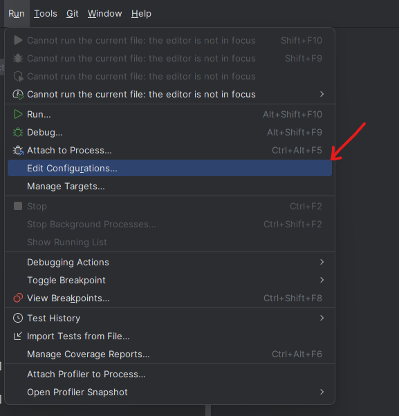
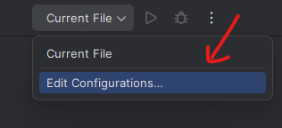
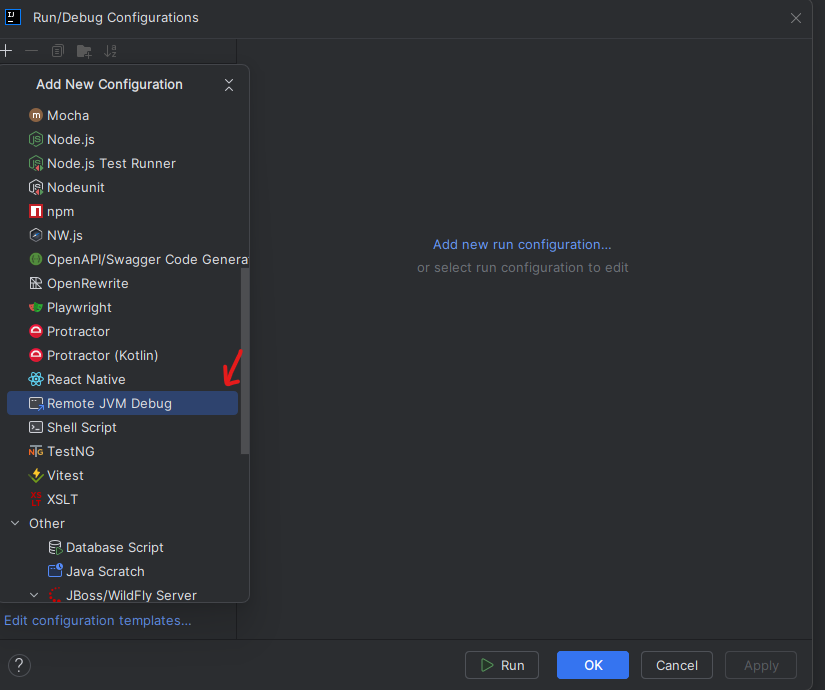
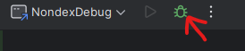

## Setting Up Remote JVM Debug Configuration in IntelliJ

### Creating the Debug Configuration

1. Open **Run** → **Edit Configurations** (use the dropdown in the top toolbar)

   
   
   Or use the dropdown next to the debug button:
   
   

2. Click the **+** button (or **Add New Configuration**)
3. Select **Remote JVM Debug** from the list of templates

   
4. Configure the debug settings:
   - **Name**: Enter `NondexDebug` (or any descriptive name)
   - **Debugger mode**: Select `Attach to remote JVM`
   - **Transport**: Keep as `Socket` (default)
   - **Host**: Set to `localhost` (default)
   - **Port**: Set to `5005` (default)
   - **Use module classpath**: Leave blank
5. Click **Apply** then **OK** to save the configuration

The configuration is now ready and will appear in the run configuration dropdown in the toolbar.

## Running Tests with Nondex
Prior to running the debugger, you should run Nondex to confirm that a test is indeed flaky. For example, you should run the following command:
`mvn -pl <module_name> edu.illinois:nondex-maven-plugin:2.2.1:nondex -Dtest=<test_name>`

By default, Nondex will run once without shuffling and three runs with shuffling. The test should fail in some of runs after the first run if it is ID flaky. Make note of the `nondexSeed` that was used in one of the runs that failed. For example, Nondex should output the following before every run:

```
CONFIG: nondexFilter=.*
nondexMode=FULL
nondexSeed=933178
nondexStart=0
nondexEnd=9223372036854775807
nondexPrintstack=false
```
Copy the `nondexSeed` as you would need this later.

## Running Tests with Nondex and Debugger

### Step 1: Set Breakpoints
1. Navigate to the test file or source code you want to debug in IntelliJ
   - For example: `MovingAverageIterableTest.java` in your project
2. Click in the **left gutter** (the area to the left of line numbers) to set breakpoints
   - A red dot will appear indicating an active breakpoint
3. Set breakpoints at key locations where you want to inspect execution:
   - Methods at the top of the stack trace when the test failed
   - Test method entry points
   - Areas where nondeterministic behavior occurs

### Step 2: Start Nondex with Debug Agent
Run the Maven command to execute Nondex with the remote debug agent enabled. This starts the test execution and suspends immediately, waiting for a debugger to attach on port 5005.

**Multi-line format:**
```bash
mvn -pl <module_name> \
  edu.illinois:nondex-maven-plugin:2.2.1:nondex \
  -Dtest=<test_name> \
  -DnondexSeed=<nondex_seed> -DnondexRuns=1 -DnondexRunsWithoutShuffling=0 \
  -Dmaven.surefire.debug="-agentlib:jdwp=transport=dt_socket,server=y,suspend=y,address=5005"
```
**Remember to replace <module_name>, <test_name>, and <nondex_seed> with the corresponding values for your test**

**Single-line format:**
```bash
mvn -pl <module_name> edu.illinois:nondex-maven-plugin:2.2.1:nondex -Dtest=<test_name> -DnondexSeed=<nondex_seed> -DnondexRuns=1 -DnondexRunsWithoutShuffling=0 -Dmaven.surefire.debug="-agentlib:jdwp=transport=dt_socket,server=y,suspend=y,address=5005"
```

**Remember to replace <module_name>, <test_name>, and <nondex_seed> with the corresponding values for your test**

**What the command does:**
- `-pl`: Specifies the Maven module to test
- `edu.illinois:nondex-maven-plugin:2.2.1:nondex`: Runs the Nondex plugin
- `-Dtest=`: Specifies the exact test method to run
- `-DnondexSeed=`: Sets a specific seed for reproducible nondeterminism
- `-DnondexRuns=1`: Executes the test once with Nondex
- `-DnondexRunsWithoutShuffling=0`: Tells Nondex to skip the first run without shuffling
- `-Dmaven.surefire.debug=...`: Enables remote debugging with JVM debug agent
  - `suspend=y`: Suspends execution until debugger attaches
  - `address=5005`: Listens on port 5005

After running this command, you'll see output indicating the test is waiting for a debugger connection:
```
Listening for transport dt_socket at address: 5005
```

### Step 3: Attach the Debugger
1. Return to IntelliJ IDEA
2. Select the **NondexDebug** configuration from the run configuration dropdown (top toolbar)
3. Click the **Debug** button (bug icon)

   
4. IntelliJ will connect to the waiting JVM process on port 5005
5. The test execution will resume and stop at your breakpoints
6. Use standard debugging controls:
   - **Step Over** (F8): Execute current line and move to next
   - **Step Into** (F7): Enter into method calls
   - **Step Out** (Shift+F8): Exit current method
   - **Resume** (F9): Continue execution to next breakpoint
   - **Evaluate Expression** (Alt+F8): Inspect variables and expressions

### Tips for Debugging with Nondex
- Watch collections and their iteration order in the Variables panel
- Compare execution across different Nondex seeds to identify nondeterministic behavior
- Set breakpoints in both test code and production code to trace execution flow